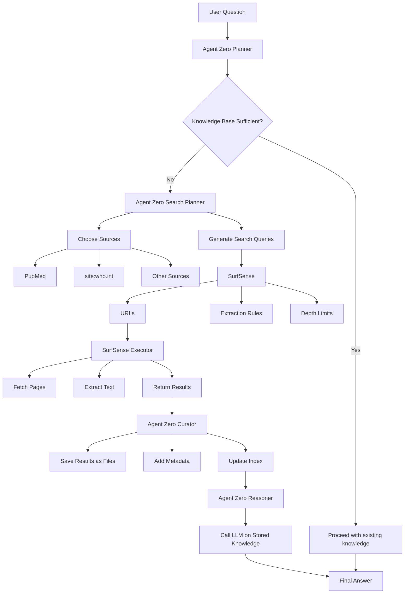

# Agent Zero Web Research Architecture

## Overview

Agent Zero Web Research is an autonomous web research system that checks knowledge base sufficiency and performs deep web searches when needed. The system integrates with existing BioDockify components and adds specialized web research capabilities.

## Architecture Diagram



## Components

### 1. Agent Zero Planner (Enhanced)

**File:** `agent_zero/core/planner.py` (extend existing)

**Responsibilities:**
- Check knowledge base for sufficient information
- Decide whether to proceed with existing knowledge or perform deep search
- Coordinate with existing PhDPlanner for stage detection

**Key Methods:**
```python
async def check_knowledge_sufficiency(query: str, context: dict) -> bool
async def plan_research_approach(query: str, context: dict) -> dict
```

### 2. Agent Zero Search Planner

**File:** `agent_zero/web_research/search_planner.py` (new)

**Responsibilities:**
- Generate search queries from user questions
- Choose appropriate sources (PubMed, WHO, etc.)
- Determine search depth and scope

**Key Methods:**
```python
async def generate_search_queries(question: str, context: dict) -> List[str]
async def choose_sources(question: str, context: dict) -> List[SourceConfig]
async def determine_search_depth(question: str) -> int
```

**Source Configuration:**
```python
@dataclass
class SourceConfig:
    name: str
    base_url: str
    search_params: dict
    extraction_rules: dict
    depth_limit: int
    priority: int
```

### 3. SurfSense (Web Scraper)

**File:** `agent_zero/web_research/surfsense.py` (new)

**Responsibilities:**
- Manage URL queue and crawling strategy
- Apply extraction rules
- Enforce depth limits
- Coordinate with Executor

**Key Methods:**
```python
async def crawl(urls: List[str], rules: ExtractionRules, depth: int) -> List[PageResult]
async def apply_extraction_rules(html: str, rules: dict) -> dict
async def respect_robots_txt(url: str) -> bool
```

**Extraction Rules:**
```python
@dataclass
class ExtractionRules:
    selectors: dict  # CSS selectors for content extraction
    clean_patterns: List[str]  # Regex patterns to remove
    preserve_tags: List[str]  # HTML tags to preserve
    min_content_length: int
    max_content_length: int
```

### 4. SurfSense Executor

**File:** `agent_zero/web_research/executor.py` (new)

**Responsibilities:**
- Fetch web pages
- Extract text content
- Handle errors and retries
- Return structured results

**Key Methods:**
```python
async def fetch_page(url: str, timeout: int = 30) -> str
async def extract_text(html: str, url: str) -> str
async def fetch_multiple(urls: List[str], max_concurrent: int = 5) -> List[PageResult]
```

**Page Result:**
```python
@dataclass
class PageResult:
    url: str
    title: str
    content: str
    metadata: dict
    timestamp: datetime
    success: bool
    error: Optional[str]
```

### 5. Agent Zero Curator

**File:** `agent_zero/web_research/curator.py` (new)

**Responsibilities:**
- Save results as files
- Add metadata to results
- Update search index
- Maintain knowledge base

**Key Methods:**
```python
async def save_results(results: List[PageResult], query: str) -> List[str]
async def add_metadata(results: List[PageResult], context: dict)
async def update_index(results: List[PageResult])
async def deduplicate_results(results: List[PageResult]) -> List[PageResult]
```

**Storage Structure:**
```
data/web_research/
├── queries/
│   ├── {query_hash}/
│   │   ├── metadata.json
│   │   ├── results/
│   │   │   ├── page_001.txt
│   │   │   ├── page_002.txt
│   │   │   └── ...
│   │   └── summary.json
├── index/
│   └── search_index.json
└── cache/
    └── pages/
```

### 6. Agent Zero Reasoner

**File:** `agent_zero/web_research/reasoner.py` (new)

**Responsibilities:**
- Call LLM on stored knowledge
- Synthesize information from multiple sources
- Generate comprehensive answers
- Cite sources

**Key Methods:**
```python
async def reason(query: str, knowledge: List[str], context: dict) -> str
async def synthesize_answer(query: str, results: List[PageResult]) -> dict
async def generate_citations(results: List[PageResult]) -> List[Citation]
```

**Answer Structure:**
```python
@dataclass
class ResearchAnswer:
    query: str
    answer: str
    sources: List[Citation]
    confidence: float
    timestamp: datetime
    metadata: dict
```

## Integration with Existing Components

### Integration Points

1. **Agent Zero Orchestrator** (`agent_zero/core/orchestrator.py`)
   - Web research as a tool in the ToolRegistry
   - Can be called when knowledge base is insufficient

2. **Knowledge Base** (`modules/rag/vector_store.py`)
   - Curator updates vector store with new content
   - Reasoner queries vector store for relevant information

3. **LLM Provider** (`modules/llm/adapters.py`)
   - Used by Search Planner for query generation
   - Used by Reasoner for answer synthesis

4. **Service Manager** (`runtime/service_manager.py`)
   - Manage SurfSense service lifecycle
   - Monitor web research operations

## Data Flow

### Query Processing Flow

```
1. User submits question
   ↓
2. Planner checks knowledge base
   ↓
3a. If sufficient → Reasoner synthesizes answer
   ↓
3b. If insufficient → Search Planner generates queries
   ↓
4. Search Planner chooses sources
   ↓
5. SurfSense crawls URLs
   ↓
6. Executor fetches and extracts content
   ↓
7. Curator saves results and updates index
   ↓
8. Reasoner synthesizes answer with citations
   ↓
9. Return answer to user
```

## Configuration

### Web Research Config (`runtime/config.yaml`)

```yaml
web_research:
  enabled: true
  max_concurrent_requests: 5
  timeout_seconds: 30
  retry_attempts: 3
  cache_enabled: true
  cache_ttl_hours: 24
  
  sources:
    pubmed:
      base_url: "https://pubmed.ncbi.nlm.nih.gov"
      priority: 1
      depth_limit: 2
    who:
      base_url: "https://www.who.int"
      priority: 2
      depth_limit: 1
    google_scholar:
      base_url: "https://scholar.google.com"
      priority: 3
      depth_limit: 1
  
  extraction:
    min_content_length: 100
    max_content_length: 100000
    preserve_tags: ["h1", "h2", "h3", "p", "li"]
    clean_patterns: ["<script.*?</script>", "<style.*?</style>"]
  
  storage:
    base_path: "./data/web_research"
    max_results_per_query: 100
    compression_enabled: true
```

## API Endpoints

### New Endpoints

```python
@app.post("/api/v2/web_research/query")
async def web_research_query(request: WebResearchRequest)
    """Execute web research query"""

@app.get("/api/v2/web_research/results/{query_id}")
async def get_research_results(query_id: str)
    """Get results of a research query"""

@app.get("/api/v2/web_research/knowledge_check")
async def check_knowledge(query: str)
    """Check if knowledge base has sufficient information"""

@app.post("/api/v2/web_research/crawl")
async def crawl_urls(request: CrawlRequest)
    """Manually trigger crawling of specific URLs"""
```

## Error Handling

### Error Categories

1. **Network Errors**
   - Connection timeout
   - DNS resolution failure
   - SSL certificate errors
   - Retry with exponential backoff

2. **Content Errors**
   - Empty pages
   - Malformed HTML
   - Content too short/long
   - Skip and log

3. **Rate Limiting**
   - Respect robots.txt
   - Implement delays between requests
   - Use polite crawling

4. **Storage Errors**
   - Disk space issues
   - File permission errors
   - Retry or alert user

## Performance Considerations

### Optimization Strategies

1. **Caching**
   - Cache fetched pages
   - Cache search results
   - Cache LLM responses

2. **Parallel Processing**
   - Concurrent page fetching
   - Async I/O throughout
   - Worker pools for CPU-bound tasks

3. **Rate Limiting**
   - Respect server limits
   - Implement request throttling
   - Use polite delays

4. **Memory Management**
   - Stream large files
   - Limit in-memory storage
   - Use disk for large datasets

## Security Considerations

### Security Measures

1. **Input Validation**
   - Sanitize user queries
   - Validate URLs
   - Prevent injection attacks

2. **Content Filtering**
   - Remove malicious content
   - Filter out ads/tracking
   - Validate HTML

3. **Privacy**
   - Respect user privacy
   - Don't store sensitive data
   - Anonymize requests

4. **Access Control**
   - Rate limiting per user
   - API key authentication
   - Audit logging

## Testing Strategy

### Test Categories

1. **Unit Tests**
   - Test each component independently
   - Mock external dependencies
   - Test error handling

2. **Integration Tests**
   - Test component interactions
   - Test with real web services
   - Test data flow

3. **End-to-End Tests**
   - Test complete query processing
   - Test with real user scenarios
   - Test performance

## Implementation Phases

### Phase 1: Core Components (Week 1)
- [ ] Implement Search Planner
- [ ] Implement SurfSense Executor
- [ ] Implement Curator
- [ ] Implement Reasoner

### Phase 2: Integration (Week 2)
- [ ] Integrate with existing Agent Zero
- [ ] Add API endpoints
- [ ] Update configuration
- [ ] Add error handling

### Phase 3: Testing & Optimization (Week 3)
- [ ] Write unit tests
- [ ] Write integration tests
- [ ] Performance optimization
- [ ] Security review

### Phase 4: Documentation & Deployment (Week 4)
- [ ] Write documentation
- [ ] Create examples
- [ ] Deploy to production
- [ ] Monitor and iterate

## Success Criteria

- [ ] Knowledge base checking works correctly
- [ ] Search queries are relevant and effective
- [ ] Web crawling is reliable and respectful
- [ ] Content extraction is accurate
- [ ] Results are properly stored and indexed
- [ ] LLM reasoning produces quality answers
- [ ] System is performant and scalable
- [ ] Security and privacy are maintained

## Next Steps

1. Review and approve this architecture
2. Create detailed implementation plans for each component
3. Set up development environment
4. Begin Phase 1 implementation
